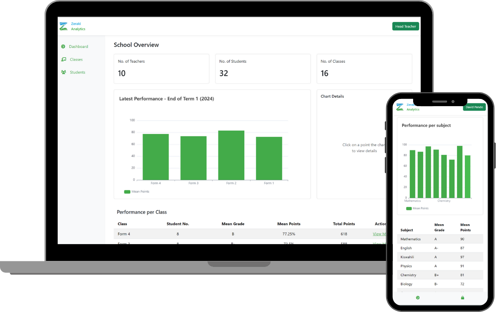

# Result Analysis Dashboard

This is a exam result analysis task submission for a web application developed using Angular 17

## Features

- Landing Page.
- Role-based access control (administrators, teachers, and students).
- Performance metrics for each academic form (Form 1, 2, 3, and 4).
- School summary metrics, including the number of teachers, students, and classes.
- Analytics for each academic form, including subject results and historical performance per term.

## What I Used

- **Angular 7** for front-end development.
- **eCharts** for data visualization.
- **Mock data** for simulation.

## How to test

- Various authentication credentials for different roles (Admin, Teachers, Students) have been provided on the login page for easy testing.
